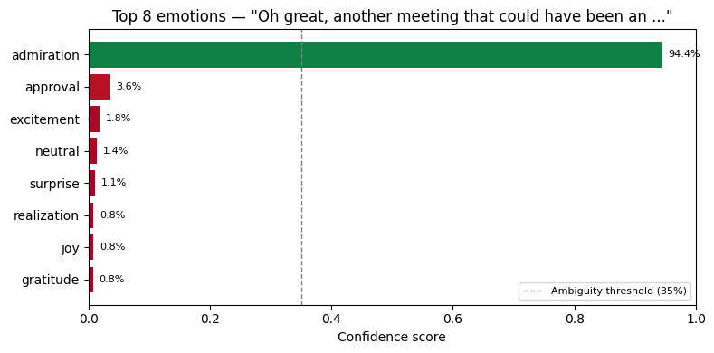
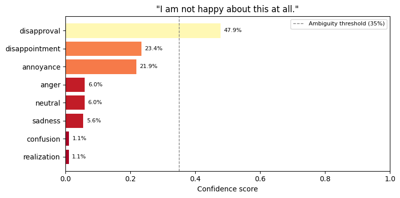
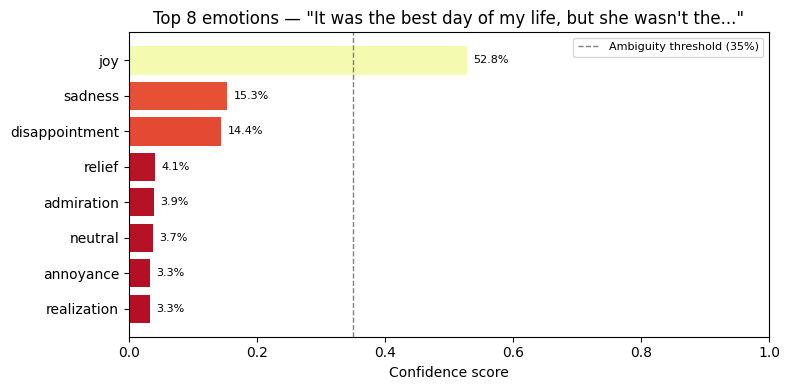
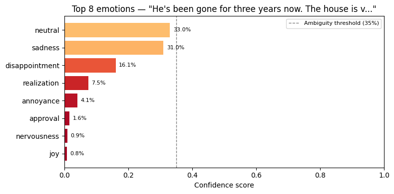
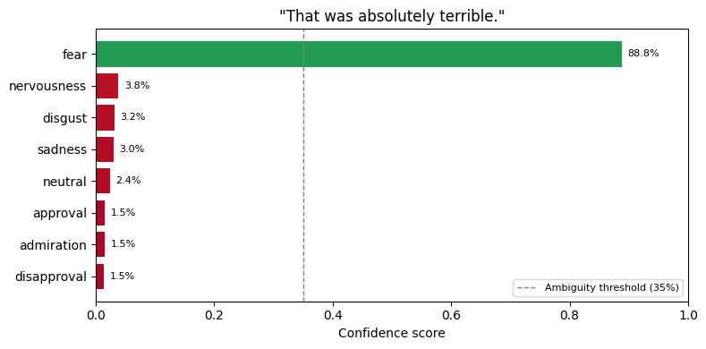
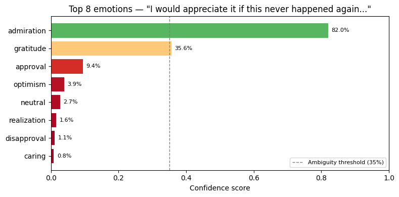

# Failure case analysis

Cell 8 of the notebook tests 6 deliberately tricky inputs. Below are the
actual model outputs recorded during a run, with analysis of why each fails.

---

### 1. Sarcasm

**Input:** "Oh great, another meeting that could have been an email."
**Expected:** annoyance / anger
**Got:** ADMIRATION — 94.4%

The model reads "great" and "could have been an email" as straightforwardly
positive. It has no sarcasm signal — GoEmotions contains very little labelled
sarcasm. The high confidence (94.4%) makes this worse: it's confidently wrong.

---

### 2. Negation

**Input:** "I am not happy about this at all."
**Expected:** annoyance / disappointment
**Got:** DISAPPROVAL — 47.9%

Partial success. The model correctly identifies a negative valence but maps it
to "disapproval" rather than "annoyance" or "disappointment". The confidence
is also relatively low (47.9%), suggesting the model is uncertain.

---

### 3. Mixed emotion

**Input:** "It was the best day of my life, but she wasn't there to see it."
**Expected:** grief + joy simultaneously
**Got:** JOY — 52.8%

The model catches the dominant positive signal and ignores the grief clause
entirely. This is a fundamental limitation of single-label classification —
it cannot output two emotions at once. The low confidence (52.8%) suggests
the model is sensing conflict but resolving it by picking the louder signal.

---

### 4. Culturally indirect grief

**Input:** "He's been gone for three years now. The house is very quiet."
**Expected:** grief / sadness
**Got:** AMBIGUOUS — neutral at 33.0% (below threshold)

The ambiguity flag fired correctly here. No single emotion crossed 35%
confidence. Rather than falsely outputting "neutral" with confidence, the
threshold honestly flags it as uncertain — this is the one case where the
safety net worked as intended.

---

### 5. Reversed intensifier

**Input:** "That was absolutely terrible."
**Expected:** disgust / anger
**Got:** FEAR — 88.8%

"Absolutely" is a high-magnitude intensifier the model associates with
positive contexts. Combined with "terrible", it produces a signal the model
interprets as extreme negative arousal — mapping to fear rather than disgust
or anger. Confidently wrong at 88.8%.

---

### 6. Professional anger

**Input:** "I would appreciate it if this never happened again."
**Expected:** anger / annoyance
**Got:** ADMIRATION — 82.0%

"I would appreciate it" is grammatically a polite request, and "appreciate"
is strongly associated with gratitude and admiration in training data. The
anger is entirely suppressed by register. This is the most socially common
failure mode — professional language routinely masks strong emotions the
model cannot detect.

---

## Summary table

| Test | Expected | Got | Confidence | Verdict |
|---|---|---|---|---|
| Sarcasm | annoyance | admiration | 94.4% | Fail — confidently wrong |
| Negation | annoyance | disapproval | 47.9% | Partial — wrong bucket, right valence |
| Mixed emotion | grief + joy | joy | 52.8% | Fail — architectural limitation |
| Indirect grief | grief | ambiguous | 33.0% | Pass — threshold caught it |
| Reversed intensifier | disgust | fear | 88.8% | Fail — confidently wrong |
| Professional anger | anger | admiration | 82.0% | Fail — confidently wrong |

---

## Takeaways

Sarcasm and polite/professional register are the two most dangerous failure
modes because the model produces high-confidence wrong predictions. The
ambiguity threshold helps for genuinely uncertain cases but does not protect
against confident errors. Mixed emotion is an architectural limitation — no
single-label classifier can solve it without changing the output format.
